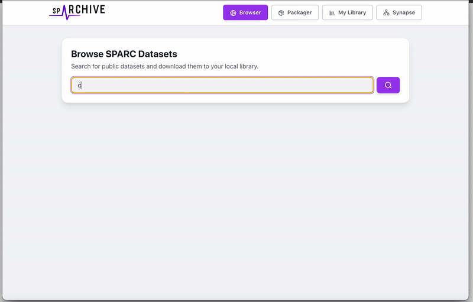

# spARCHIVE : Offline SPARC Data Viewer

<p align="center">
  
</p>

# Table of Contents

1.  [Introduction](#introduction)
2.  [The Challenge](#the-challenge)
3.  [Our Solution: spARCHIVE](#our-solution-sparchive)
4.  [Alignment with FAIR Principles](#alignment-with-fair-principles)
5.  [Key Features](#key-features)
6.  [Architecture](#architecture)
7.  [Functionality Overview](#functionality-overview)
8.  [Getting Started](#getting-started)
9.  [Future Directions](#future-directions)
9.  [Team Members](#team-members)

## Introduction

The SPARC (Stimulating Peripheral Activity to Relieve Conditions) portal provides invaluable access to a vast collection of scientific datasets. **spARCHIVE** is an **offline-first desktop application** designed to bring the power of the SPARC repository directly to your local machine.

It provides a robust, user-friendly interface to browse, download, and manage datasets, ensuring you have permanent offline access. Datasets are saved in a compressed, portable format, making them easy to store and share.

## The Challenge

While the SPARC portal is excellent for online data discovery, researchers often face challenges when working with datasets locally:

* **Offline Access:** Consistent and efficient access to data is not always possible without a local, well-organized copy.
* **Manual Downloads:** Downloading datasets, especially large ones with numerous files, can be a cumbersome process.
* **Data Organization:** Keeping track of multiple downloaded datasets, their versions, and associated metadata can become disorganized quickly.
* **Portability:** Sharing entire datasets with collaborators can be difficult due to the large number of files and their total size, making data transfer inefficient.
* **File Exploration:** Datasets contain a wide variety of file types. Previewing them often requires multiple specialized software tools.

## Our Solution: spARCHIVE

**spARCHIVE** addresses these challenges by providing an all-in-one desktop solution for SPARC dataset management. It acts as your personal, local library for SPARC data, equipped with tools that make finding, viewing, and managing your datasets a seamless experience.

With spARCHIVE, you can:

* **Work Offline:** Access and explore all your downloaded datasets without an internet connection.
* **Discover:** Search the entire public SPARC repository from the comfort of a desktop app.
* **Package & Share:** It compresses datasets into a single, portable `.sparchive` file. This makes it incredibly easy to store, manage, and share entire datasets with colleagues.
* **Organize:** Maintain a clean, visual library of all your local datasets.
* **Explore:** Dive into the contents of datasets with an integrated file viewer that supports multiple formats.

## Alignment with FAIR Principles

spARCHIVE directly enhances the FAIR-ness of SPARC datasets for researchers:

-   **Findable:** The integrated **Dataset Browser** allows users to search the SPARC repository by keywords and dataset IDs, making it easy to find relevant data.
-   **Accessible:** As an **offline-first desktop application**, it makes data accessible anytime, anywhere, without reliance on an internet connection. The internal file viewer makes the content of various file formats immediately accessible without needing external software.
-   **Interoperable:** The portable **`.sparchive` format** makes entire datasets interoperable between users of the application. A collaborator can simply send a single `.sparchive` file, which can be uploaded and viewed, ensuring both parties are working with the exact same data package.
-   **Reusable:** By simplifying the download, organization, and exploration process, spARCHIVE lowers the barrier to reusing datasets. The ease of sharing via the `.sparchive` format promotes the reuse of data across different research teams.

## Key Features

* **SPARC Dataset Browser**:
    * Search for public datasets using keywords.
    * View search results with essential metadata, including dataset ID, version, and size.
    * See which datasets are already in your local library directly from the search results.
* **Direct Packager**:
    * Download any dataset directly by providing its SPARC Dataset ID.
* **Local Library**:
    * A central hub to view and manage all your downloaded datasets.
    * Visual card-based layout with dataset titles, IDs, and author information.
    * **Portable `.sparchive` Format:** Downloads are packaged into a compressed `.sparchive` file, making them easy to manage and transfer. You can also upload existing `.sparchive` files from collaborators directly into your library.
    * Quick actions to delete a dataset or open its location in your file system.
* **Advanced File Viewer**:
    * Explore the complete file and folder structure of a dataset in a familiar tree view.
    * Search for specific files within a dataset.
    * **Content Preview Pane:** View the contents of various file types without leaving the app:
        * **Images:** Renders common image formats.
        * **Text & JSON:** Displays plain text and provides formatted, collapsible views for JSON files.
        * **Tables:** Renders CSV/TSV files in a sortable, easy-to-read data grid.
    * Download individual files from a dataset directly to your machine.
* **Real-time Progress**:
    * A global progress indicator keeps you informed about ongoing downloads, successful completions, or errors.
    * Confirmation modals for downloads and deletions to prevent accidental actions.

## Architecture

spARCHIVE is built as a modern desktop application using a robust and maintainable technology stack:

* **Frontend**: The user interface is built with **React**, providing a dynamic and responsive experience. Components are crafted for clarity and ease of use, with icons provided by **Lucide-React**.
* **Desktop Framework**: **Electron** is used to wrap the web application into a cross-platform desktop app, enabling deep integration with the operating system for file system access and notifications.
* **Backend Communication**: The React frontend communicates with Electron's main process via the `contextBridge` (`window.electronAPI`), allowing it to securely access native capabilities like file I/O and network requests.

The application is structured into several key views: `BrowserView`, `PackagerView`, `LibraryView`, and `FileViewer`, each handling a distinct piece of the application's functionality.

## Functionality Overview

### Browse and Download Datasets from SPARC Portal

Search for datasets on the SPARC portal. The interface shows which datasets you already have. Click "Download" to add a new dataset to your library.


Downloading is as easy as one click


Or enter the dataset id to get it downloaded to your offline library


### Manage Your Local Library

Your library provides a clean overview of all downloaded datasets. From here, you can select a package to view its contents, delete it, or open its folder.

### Explore Package Contents

Once you open a dataset, you can navigate its file tree on the left and preview the content of any selected file on the right.

### SYNAPSE Integration

We also developed SYNAPSE to generate synthetic EEG data, currently it's being hosted on another platform but in the future we're expecting it to be integrated to spARCHIVE. More info about SYNAPSE and the models that we developed can be checked from the branch `VAE-signal-generator` and `proto/signal-gen-api`

## Getting Started

To run spARCHIVE on your local machine, download the [latest release](https://github.com/SPARC-FAIR-Codeathon/2025-team-A/releases/tag/0.10) or if you want to run the development version, follow these setup instructions:

1.  **Clone the repository:**
    ```bash
    git clone [https://github.com/your-username/sparchive.git](https://github.com/your-username/sparchive.git)
    cd sparchive
    ```

2.  **Install dependencies:**
    ```bash
    npm install
    ```

3.  **Run the application:**
    ```bash
    npm start
    ```

## Future Directions

We are continuously looking to improve spARCHIVE. Future enhancements may include:

* **Advanced Search Filters**: Filter datasets by tags, authors, or other metadata fields.
* **Expanded File Previews**: Add support for more complex file types, such as 3D models or specialized biological data formats.
* **Dataset Versioning**: Manage multiple versions of the same dataset.

## Team Members
- Haries Ramdhani (Team Lead, Developer (Fullstack))
- Akram Zarchini (Developer (AI/ML), Documentation)
- Maryam Saeedi (Developer (Data/API), Documentation)
